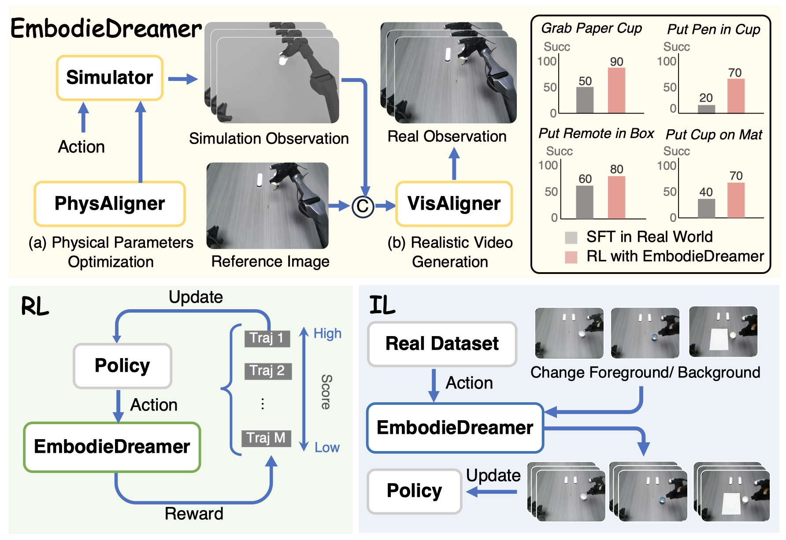

<div align="center">   
  
# EmbodieDreamer: Advancing Real2Sim2Real Transfer for Policy Training via Embodied World Modeling

</div>

<!-- [Project Page](https://humandreamer.github.io/)  | [Paper](https://arxiv.org/abs/2503.24026)  -->
[](https://embodiedreamer.github.io/)
[](https://arxiv.org/abs/2507.05198)
<!-- [](https://opensource.org/licenses/MIT) -->


<div align="center">

</div>

EmbodieDreamer is a unified Real2Sim2Real framework that incorporates PhysAligner for
rapid physical parameter optimization from real observations and VisAligner for generating visually
realistic scenes. Furthermore, EmbodieDreamer supports RL training of policy models through
preference learning based on trajectory evaluation, and facilitates IL training by generating diverse,
unseen observations. Models trained within EmbodieDreamer show significantly better performance
compared to policies fine-tuned on real-world data.

<!-- ## Method Overview

Training pipeline of the proposed *Text-to-Pose* generation. Pose data are encoded in latent space via the Pose VAE, which are then processed by the proposed MotionDiT, where local feature aggregation and global attention are utilized to capture information from the entire pose sequence. Finally, the LAMA loss is calculated via the proposed CLoP, which enhances the training of MotionDiT.

 -->

<!-- The pipeline of *Pose-to-Video*.

 -->
# Project Status
- [2025/7]： ✅Repository Initialization.
---

<!-- ## License
All the data and code within this repo are under [CC BY-NC-SA 4.0](https://creativecommons.org/licenses/by-nc-sa/4.0/). -->

## BibTeX

```bibtex
@article{wang2025embodiedreamer,
    title={EmbodieDreamer: Advancing Real2Sim2Real Transfer for Policy Training via Embodied World Modeling}, 
    author={Boyuan Wang and Xinpan Meng and Xiaofeng Wang and Zheng Zhu and Angen Ye and Yang Wang and Zhiqin Yang and Chaojun Ni and Guan Huang and Xingang Wang},
    journal={arXiv preprint arXiv:2507.05198},
    year={2025},
}
  